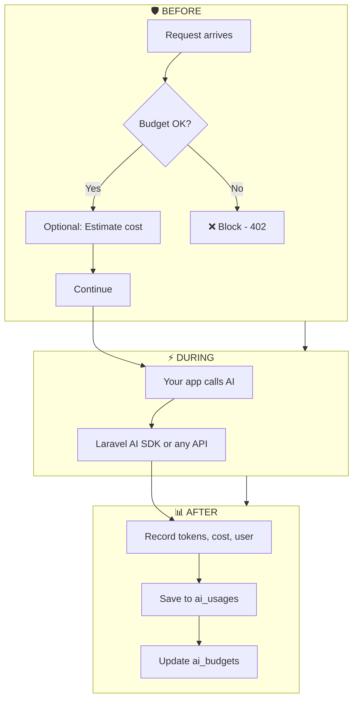
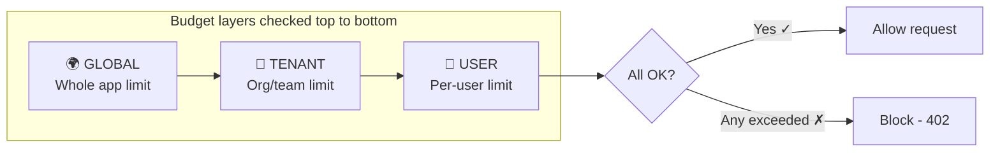
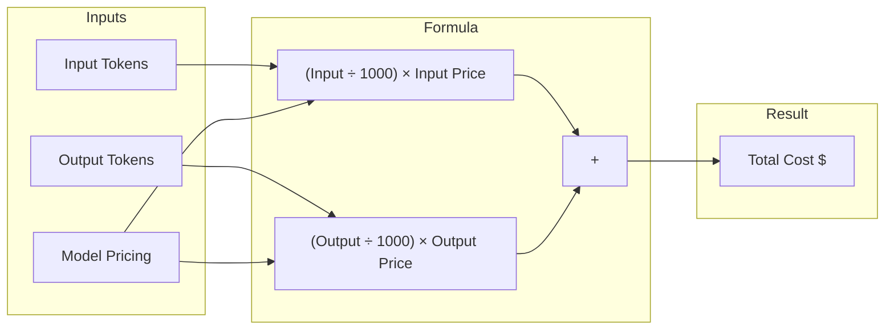
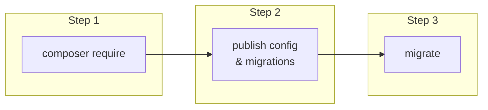
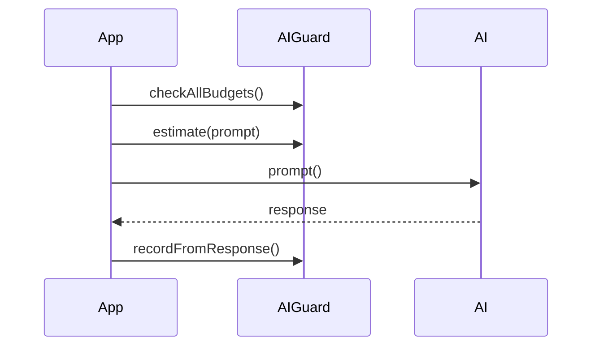
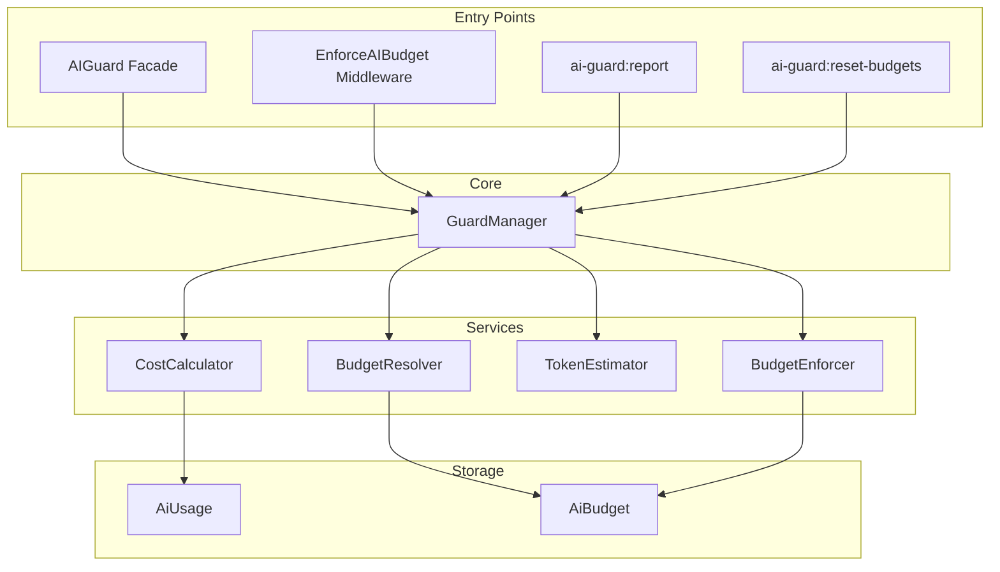

# Laravel AI Guard 🛡️

<strong>Track costs • Set budgets • Never get surprised by the bill. </strong><br>

<p>
   Laravel AI Guard is a powerful AI cost optimization package built for the Laravel AI SDK (12.x) 🚀.
  It helps Laravel developers track OpenAI & LLM token usage 📊, estimate AI costs before execution ⚠️, enforce per-user or per-tenant AI budgets 🧾, and prevent unexpected AI billing spikes 💥 in production.
</p>
  <p>
      Designed for Laravel SaaS applications, APIs, and AI-powered platforms, Laravel AI Guard acts as a financial firewall 🛡️ between your app and AI providers—keeping AI usage safe, predictable, and cost-efficient 💸.
  </p>
---

## 📑 Quick Navigation

| Jump to                                 | Jump to                                  |
| --------------------------------------- | ---------------------------------------- |
| [What's Inside](#-whats-inside)         | [How It Works](#-how-it-works)           |
| [Quick Start](#-quick-start-in-3-steps) | [Usage Examples](#-usage-examples)       |
| [Configuration](#️-configuration)        | [Package Structure](#-package-structure) |

---

## ✨ What's Inside

```
┌─────────────────────────────────────────────────────────────────────────────────┐
│                                                                                  │
│   ┌─────────────┐  ┌─────────────┐  ┌─────────────┐  ┌─────────────┐           │
│   │   TRACK     │  │   BUDGET    │  │  ESTIMATE   │  │   BLOCK     │           │
│   │  Every call │  │ Per user/   │  │ Before you  │  │ Over-spend  │           │
│   │  in DB      │  │ tenant/app  │  │ call (free) │  │ requests    │           │
│   └─────────────┘  └─────────────┘  └─────────────┘  └─────────────┘           │
│                                                                                  │
│                        ┌─────────────────────────┐                              │
│                        │   🚨 KILL SWITCH        │                              │
│                        │   Disable all AI        │                              │
│                        │   in one config change  │                              │
│                        └─────────────────────────┘                              │
│                                                                                  │
└─────────────────────────────────────────────────────────────────────────────────┘
```

**Works with:** Laravel AI SDK (12.x) • OpenAI • Anthropic • Any AI API

---

## 🔄 How It Works

### Request Flow (Before → During → After)



### Budget Hierarchy (Checked in Order)



> **TL;DR:** Laravel AI SDK does the AI. Laravel AI Guard decides _whether_ you're allowed to call and _how much_ you spent. They work together.

---

## 🤔 Why Should I Care?

```
     WITHOUT AI GUARD                    WITH AI GUARD
┌─────────────────────────┐      ┌─────────────────────────┐
│  💸 Surprise bill       │      │  📊 Full visibility     │
│  🐛 Runaway loop?       │  →   │  🛑 Budget limits       │
│  😰 Invoice shock       │      │  😌 Predictable costs   │
└─────────────────────────┘      └─────────────────────────┘
```

AI APIs charge **by the token**. One heavy user, one bug—and your bill spikes. Most apps don't track until the invoice arrives. AI Guard gives you **visibility**, **limits**, and **control**.

---

## 📐 Under the Hood

### Cost Calculation



**Example:** 500 input + 200 output tokens (gpt-4o: $0.0025/1k in, $0.01/1k out)

| Step        | Calculation           | Result       |
| ----------- | --------------------- | ------------ |
| Input cost  | (500 ÷ 1000) × 0.0025 | $0.00125     |
| Output cost | (200 ÷ 1000) × 0.01   | $0.00200     |
| **Total**   |                       | **$0.00325** |

---

### Estimation (No API Call = No Cost)

```
┌──────────────────────────────────────────────────────────┐
│  AIGuard::estimate($prompt)                               │
│                                                           │
│  Input tokens  ≈  characters ÷ 4    (configurable)       │
│  Output tokens ≈  input × 0.5       (configurable)       │
│                                                           │
│  "Write a short poem" (18 chars) → ~5 in, ~3 out → 8     │
└──────────────────────────────────────────────────────────┘
```

---

### Kill Switch

| Method                   | How                      |
| ------------------------ | ------------------------ |
| **`.env`** (recommended) | `AI_GUARD_DISABLED=true` |
| **Config**               | `'ai_disabled' => true`  |

**Result:** Middleware returns `503 Service Unavailable` — no AI calls get through.

---

## 💡 5 Ways to Reduce AI Costs

```
    ① ESTIMATE         ② BUDGET          ③ TRACK           ④ KILL SWITCH      ⑤ TAG
┌─────────────┐   ┌─────────────┐   ┌─────────────┐   ┌─────────────┐   ┌─────────────┐
│ Show cost   │   │ Set limits   │   │ Run report  │   │ Emergency   │   │ Break down  │
│ before call │   │ per user/    │   │ to see      │   │ stop all    │   │ by feature  │
│             │   │ tenant       │   │ where $ goes│   │ AI if needed│   │ (chat, etc) │
└─────────────┘   └─────────────┘   └─────────────┘   └─────────────┘   └─────────────┘
```

---

## 📋 Requirements

| Requirement    | Version                         |
| -------------- | ------------------------------- |
| PHP            | 8.1+                            |
| Laravel        | 10.x, 11.x, or 12.x             |
| Laravel AI SDK | Optional (for agents/streaming) |

---

## 🚀 Quick Start (3 Steps)



**1. Install**

```bash
composer require subhashladumor1/laravel-ai-guard
```

**2. Publish & migrate**

```bash
php artisan vendor:publish --tag=ai-guard-config
php artisan vendor:publish --tag=ai-guard-migrations
php artisan migrate
```

**3. Optional — translations**

```bash
php artisan vendor:publish --tag=ai-guard-lang
```

Creates: `ai_usages` (every call) + `ai_budgets` (limits & usage)

---

## ⚙️ Configuration

Edit `config/ai-guard.php` after publishing:

| Setting            | Purpose                               |
| ------------------ | ------------------------------------- |
| `ai_disabled`      | Turn off all AI                       |
| `pricing`          | Cost per 1k tokens per model          |
| `default_model`    | Fallback (e.g. `gpt-4o`)              |
| `default_provider` | Fallback (e.g. `openai`)              |
| `budgets`          | Limits (global, user, tenant); period |
| `estimation`       | Chars per token, output multiplier    |

**Example `.env`:**

```env
AI_GUARD_DISABLED=false
AI_GUARD_GLOBAL_LIMIT=100
AI_GUARD_USER_LIMIT=10
AI_GUARD_TENANT_LIMIT=50
```

---

## 📖 Usage Examples

### With Laravel AI SDK (12.x)



```php
// 1. Before — check budget
AIGuard::checkAllBudgets(auth()->id(), $tenantId);
$estimate = AIGuard::estimate($userPrompt);

// 2. Call AI (as normal)
$response = (new YourAgent)->prompt($userPrompt);

// 3. After — record usage
AIGuard::recordFromResponse($response, userId: auth()->id(), tenantId: $tenantId, tag: 'chat');
```

**Streaming:** record in `->then()` callback when stream finishes.

---

### With Any Other AI API

```php
// Before — same
AIGuard::checkAllBudgets(auth()->id(), $tenantId);

// After — record manually
AIGuard::recordAndApplyBudget([
    'provider' => 'openai',
    'model' => 'gpt-4o',
    'input_tokens' => 400,
    'output_tokens' => 250,
    'user_id' => auth()->id(),
    'tenant_id' => $tenantId,
    'tag' => 'chat',
]);
```

---

### Middleware

```php
Route::post('/chat', ChatController::class)->middleware('ai.guard');
```

| Condition   | Response   |
| ----------- | ---------- |
| Over budget | 402 + JSON |
| AI disabled | 503        |

---

### Artisan Commands

| Command                                        | Purpose                |
| ---------------------------------------------- | ---------------------- |
| `php artisan ai-guard:report`                  | Usage & cost report    |
| `php artisan ai-guard:report --period=month`   | Monthly report         |
| `php artisan ai-guard:report --days=7`         | Last 7 days            |
| `php artisan ai-guard:reset-budgets`           | Reset when period ends |
| `php artisan ai-guard:reset-budgets --dry-run` | Preview only           |

**Schedule reset:** `$schedule->command('ai-guard:reset-budgets')->daily();`

---

## 🗂️ Package Structure



```
laravel-ai-guard/
├── src/
│   ├── GuardManager.php          # Core logic
│   ├── Facades/AIGuard.php
│   ├── Budget/                   # BudgetResolver, BudgetEnforcer
│   ├── Cost/                     # TokenEstimator, CostCalculator
│   ├── Models/                   # AiUsage, AiBudget
│   ├── Middleware/
│   ├── Commands/
│   └── Exceptions/
├── database/migrations/
├── lang/                         # 11 locales
└── tests/
```

---

## 🌍 Multi-Language

**11 locales:** en, ar, es, fr, de, zh, hi, bn, pt, ru, ja

App locale used automatically. Customize: `php artisan vendor:publish --tag=ai-guard-lang`

---

## 🏢 Multi-Tenant (SaaS)

- Store `tenant_id` on each usage
- Set tenant budgets in config
- Middleware reads tenant from `X-Tenant-ID` header or request attribute

---

## 🧪 Testing

```bash
composer install && php artisan test
```

---

## 📄 License

MIT. See [LICENSE](LICENSE).
