# Laravel AI Guard 🛡️

<strong>Track costs • Set budgets • Never get surprised by the bill. </strong><br>

<p>
   Laravel AI Guard is a powerful AI cost optimization package built for the Laravel AI SDK (12.x) 🚀.
  It helps Laravel developers track OpenAI & LLM token usage 📊, estimate AI costs before execution ⚠️, enforce per-user or per-tenant AI budgets 🧾, and prevent unexpected AI billing spikes 💥 in production.
</p>
  <p>
      Designed for Laravel SaaS applications, APIs, and AI-powered platforms, Laravel AI Guard acts as a financial firewall 🛡️ between your app and AI providers—keeping AI usage safe, predictable, and cost-efficient 💸.
  </p>
---

## 📑 Quick Navigation

| Jump to                                 | Jump to                                  |
| --------------------------------------- | ---------------------------------------- |
| [What's Inside](#-whats-inside)         | [How It Works](#-how-it-works)           |
| [Quick Start](#-quick-start-in-3-steps) | [Usage Examples](#-usage-examples)       |
| [Configuration](#️-configuration)        | [Package Structure](#-package-structure) |

---

## ✨ What's Inside

```
┌─────────────────────────────────────────────────────────────────────────────────┐
│                                                                                  │
│   ┌─────────────┐  ┌─────────────┐  ┌─────────────┐  ┌─────────────┐           │
│   │   TRACK     │  │   BUDGET    │  │  ESTIMATE   │  │   BLOCK     │           │
│   │  Every call │  │ Per user/   │  │ Before you  │  │ Over-spend  │           │
│   │  in DB      │  │ tenant/app  │  │ call (free) │  │ requests    │           │
│   └─────────────┘  └─────────────┘  └─────────────┘  └─────────────┘           │
│                                                                                  │
│                        ┌─────────────────────────┐                              │
│                        │   🚨 KILL SWITCH        │                              │
│                        │   Disable all AI        │                              │
│                        │   in one config change  │                              │
│                        └─────────────────────────┘                              │
│                                                                                  │
└─────────────────────────────────────────────────────────────────────────────────┘
```

**Works with:** Laravel AI SDK (12.x) • OpenAI • Anthropic • Any AI API

---

## 🔄 How It Works

### Request Flow (Before → During → After)

```mermaid
flowchart TD
    subgraph BEFORE["🛡️ BEFORE"]
        A[Request arrives] --> B{Budget OK?}
        B -->|Yes| C[Optional: Estimate cost]
        B -->|No| D[❌ Block - 402]
        C --> E[Continue]
    end

    subgraph DURING["⚡ DURING"]
        E --> F[Your app calls AI]
        F --> G[Laravel AI SDK or any API]
    end

    subgraph AFTER["📊 AFTER"]
        G --> H[Record tokens, cost, user]
        H --> I[Save to ai_usages]
        I --> J[Update ai_budgets]
    end

    BEFORE --> DURING --> AFTER
```



### Budget Hierarchy (Checked in Order)

```mermaid
flowchart LR
    subgraph layers["Budget layers checked top to bottom"]
        direction TB
        A["🌍 GLOBAL<br/>Whole app limit"]
        B["🏢 TENANT<br/>Org/team limit"]
        C["👤 USER<br/>Per-user limit"]
    end

    A --> B --> C

    C --> D{All OK?}
    D -->|Yes ✓| E[Allow request]
    D -->|Any exceeded ✗| F[Block - 402]
```



> **TL;DR:** Laravel AI SDK does the AI. Laravel AI Guard decides _whether_ you're allowed to call and _how much_ you spent. They work together.

---

## 🤔 Why Should I Care?

```
     WITHOUT AI GUARD                    WITH AI GUARD
┌─────────────────────────┐      ┌─────────────────────────┐
│  💸 Surprise bill       │      │  📊 Full visibility     │
│  🐛 Runaway loop?       │  →   │  🛑 Budget limits       │
│  😰 Invoice shock       │      │  😌 Predictable costs   │
└─────────────────────────┘      └─────────────────────────┘
```

AI APIs charge **by the token**. One heavy user, one bug—and your bill spikes. Most apps don't track until the invoice arrives. AI Guard gives you **visibility**, **limits**, and **control**.

---

## 📐 Under the Hood

### Cost Calculation


**Example:** 500 input + 200 output tokens (gpt-4o: $0.0025/1k in, $0.01/1k out)

| Step        | Calculation           | Result       |
| ----------- | --------------------- | ------------ |
| Input cost  | (500 ÷ 1000) × 0.0025 | $0.00125     |
| Output cost | (200 ÷ 1000) × 0.01   | $0.00200     |
| **Total**   |                       | **$0.00325** |

---

### Cost Optimization (Context Caching) ⚡

Laravel AI Guard supports advanced pricing models including **Context Caching** (Anthropic, Gemini, OpenAI) to help you track savings accuracy.

**Supported Pricing Dimensions:**
- **Input Tokens** (Standard)
- **Output Tokens** (Standard)
- **Cached Input Tokens** (Read from cache — typically ~50-90% cheaper)
- **Cache Creation Tokens** (Write to cache — sometimes higher cost)
- **Long context** (e.g. >200k tokens — premium `input_long` / `output_long` rates)
- **Modality-specific:** image tokens, audio tokens, **per image**, **per second video**, **per minute transcription**, **TTS per 1M characters**, **web search per 1k calls**, **embeddings per 1k tokens**

**Configuration Example (`config/ai-guard.php`):**

```php
'claude-3-5-sonnet' => [
    'input' => 0.003,
    'output' => 0.015,
    'cache_write' => 0.00375, // +25% overhead
    'cached_input' => 0.0003, // -90% savings
],
```

The package automatically detects cache usage from provider responses and applies the correct lower rate.

---

### Supported Providers, Models & Cost Coverage 📐

Pricing is aligned with **official 2026 API docs** for **maximum accurate cost calculation** across **Chat**, **Assistants**, **Agents**, and modality-specific use cases.

| Provider | Pricing Source | Coverage |
| :--- | :--- | :--- |
| **OpenAI** | [Pricing](https://developers.openai.com/api/docs/pricing) | GPT-5.x, GPT-4o, o1, Realtime (Audio/Text), DALL·E 3, Whisper, TTS, Web Search |
| **Google Gemini** | [Pricing](https://ai.google.dev/gemini-api/docs/pricing) | Gemini 3 Pro/Flash, 2.5 Pro/Flash, 1.5, Imagen 3, Veo (Video), Embeddings |
| **Anthropic** | [Pricing](https://platform.claude.com/docs/en/about-claude/pricing) | Claude 4.5, 3.5 Sonnet, 3 Opus, Haiku, Prompt Caching, Long Context |
| **xAI Grok** | [Models](https://docs.x.ai/developers/models) | Grok 4, Grok 3, Grok Beta, Web Search Tool |
| **Mistral AI** | [Pricing](https://mistral.ai/pricing#api) | Mistral Large 2, Small, Codestral, Embeddings |
| **DeepSeek** | [Pricing](https://api-docs.deepseek.com/quick_start/pricing) | DeepSeek-V3, R1 (Reasoner), Cache Hit/Miss pricing |

**Full Multimodal Cost Support:**

- **LLM / Chat:** Input, Output, Cached Input, Cache Write, Long-Context pricing
- **Agents:** Web Search (per 1k calls), Code Interpreter (Session based)
- **Audio:**
  - **Input:** Audio tokens (e.g. Gemini 2.5 Flash `audio_in`, GPT-4o `audio_in`)
  - **Output:** Audio tokens (e.g. GPT-4o `audio_out`)
  - **Transcription:** Per minute (Whisper)
  - **TTS:** Per 1M characters (OpenAI TTS)
- **Video:**
  - **Input:** Video tokens (e.g. Gemini `video_in`)
  - **Generation:** Per second (Veo `per_second_video`)
- **Image:**
  - **Input:** Image tokens (e.g. GPT-4o `image_in`)
  - **Generation:** Per image (DALL·E 3, Imagen)
- **Embeddings:** Per 1k tokens

Pass extended `usage` when recording to get accurate totals:

```php
AIGuard::recordAndApplyBudget([
    'provider' => 'gemini',
    'model' => 'gemini-2.5-flash',
    'input_tokens' => 1000,
    'output_tokens' => 200,
    'usage' => [
        'input_tokens' => 1000,           // Text tokens
        'output_tokens' => 200,           // Text output
        'video_tokens_in' => 5000,        // Video understanding tokens
        'audio_tokens_in' => 2000,        // Audio input tokens
        'images_generated' => 1,          // Image gen quantity
        'web_search_calls' => 2,          // Per-call tool usage
    ],
    'user_id' => auth()->id(),
]);
```
---

### Estimation (No API Call = No Cost)

```
┌──────────────────────────────────────────────────────────┐
│  AIGuard::estimate($prompt)                               │
│                                                           │
│  Input tokens  ≈  characters ÷ 4    (configurable)       │
│  Output tokens ≈  input × 0.5       (configurable)       │
│                                                           │
│  "Write a short poem" (18 chars) → ~5 in, ~3 out → 8     │
└──────────────────────────────────────────────────────────┘
```

---

### Kill Switch

| Method                   | How                      |
| ------------------------ | ------------------------ |
| **`.env`** (recommended) | `AI_GUARD_DISABLED=true` |
| **Config**               | `'ai_disabled' => true`  |

**Result:** Middleware returns `503 Service Unavailable` — no AI calls get through.

---

## 💡 5 Ways to Reduce AI Costs

```
    ① ESTIMATE         ② BUDGET          ③ TRACK           ④ KILL SWITCH      ⑤ TAG
┌─────────────┐   ┌─────────────┐   ┌─────────────┐   ┌─────────────┐   ┌─────────────┐
│ Show cost   │   │ Set limits   │   │ Run report  │   │ Emergency   │   │ Break down  │
│ before call │   │ per user/    │   │ to see      │   │ stop all    │   │ by feature  │
│             │   │ tenant       │   │ where $ goes│   │ AI if needed│   │ (chat, etc) │
└─────────────┘   └─────────────┘   └─────────────┘   └─────────────┘   └─────────────┘
```

---

## 📋 Requirements

| Requirement    | Version                         |
| -------------- | ------------------------------- |
| PHP            | 8.1+                            |
| Laravel        | 10.x, 11.x, or 12.x             |
| Laravel AI SDK | Optional (for agents/streaming) |

---

## 🚀 Quick Start (3 Steps)


**1. Install**

```bash
composer require subhashladumor1/laravel-ai-guard
```

**2. Publish & migrate**

```bash
php artisan vendor:publish --tag=ai-guard-config
php artisan vendor:publish --tag=ai-guard-migrations
php artisan migrate
```

**3. Optional — translations**

```bash
php artisan vendor:publish --tag=ai-guard-lang
```

creates: `ai_usages` (tracks every request & cost) + `ai_budgets` (stores current usage vs limit)

---

## ⚙️ Configuration

Edit `config/ai-guard.php` after publishing:

| Setting            | Purpose                               |
| ------------------ | ------------------------------------- |
| `ai_disabled`      | Turn off all AI                       |
| `pricing`          | Cost per 1k tokens per model          |
| `default_model`    | Fallback (e.g. `gpt-4o`)              |
| `default_provider` | Fallback (e.g. `openai`)              |
| `budgets`          | Limits (global, user, tenant); period |
| `estimation`       | Chars per token, output multiplier    |

**Example `.env`:**

```env
AI_GUARD_DISABLED=false
AI_GUARD_GLOBAL_LIMIT=100
AI_GUARD_USER_LIMIT=10
AI_GUARD_TENANT_LIMIT=50
```

---

## 📖 Usage Examples

### With Laravel AI SDK (12.x)


```php
// 1. Before — check budget
AIGuard::checkAllBudgets(auth()->id(), $tenantId);
$estimate = AIGuard::estimate($userPrompt);

// 2. Call AI (as normal)
$response = (new YourAgent)->prompt($userPrompt);

// 3. After — record usage
AIGuard::recordFromResponse($response, userId: auth()->id(), tenantId: $tenantId, tag: 'chat');
```

**Multi-model:** Pass `model` and `provider` so estimate and budgets use the right cost:

```php
$estimate = AIGuard::estimate($userPrompt, model: 'gpt-4o-mini', provider: 'openai');
AIGuard::recordFromResponse($response, userId: auth()->id(), provider: 'openai', model: 'gpt-4o-mini');
```

**Streaming:** record in `->then()` callback when stream finishes.

---

### With Any Other AI API

```php
// Before — same
AIGuard::checkAllBudgets(auth()->id(), $tenantId);

// After — record manually
AIGuard::recordAndApplyBudget([
    'provider' => 'openai',
    'model' => 'gpt-4o',
    'input_tokens' => 400,
    'output_tokens' => 250,
    'user_id' => auth()->id(),
    'tenant_id' => $tenantId,
    'tag' => 'chat',
]);
```

**Extended usage (audio, video, image, tools)** — pass a `usage` array for accurate cost when using modalities or tools:

```php
AIGuard::recordAndApplyBudget([
    'provider' => 'openai',
    'model' => 'gpt-4o',
    'input_tokens' => 500,
    'output_tokens' => 300,
    'usage' => [
        'input_tokens' => 500,
        'output_tokens' => 300,
        'cached_input_tokens' => 0,
        'images_generated' => 2,           // DALL·E / image models
        'web_search_calls' => 5,           // agent tool calls
        'transcription_minutes' => 1.5,    // Whisper / transcribe
        'tts_characters' => 2500,         // TTS
        'embedding_tokens' => 1000,        // embeddings
        'video_seconds' => 10,             // Veo / video gen
    ],
    'user_id' => auth()->id(),
    'tag' => 'agent-with-search',
]);
```

---

### Multi-model and dynamic cost (no config change)

Cost is resolved in order: **per-call override** → **runtime pricing** → **config**. So you can support many models and change costs at runtime without editing `config/ai-guard.php`.

**1. Per-call pricing override** — pass pricing for a single estimate or record:

```php
// Estimate with custom cost per 1k tokens (no config entry needed)
$estimate = AIGuard::estimate($userPrompt, 'my-model', 'my-provider', [
    'input' => 0.001,
    'output' => 0.002,
]);

// Record with custom pricing when cost isn't pre-calculated
AIGuard::recordFromResponse($response, auth()->id(), $tenantId, 'openai', 'gpt-4o', 'chat', [
    'input' => 0.0025,
    'output' => 0.01,
]);

// record() can omit 'cost' and use 'pricing' to calculate
AIGuard::record([
    'provider' => 'openai',
    'model' => 'gpt-4o',
    'input_tokens' => 400,
    'output_tokens' => 250,
    'pricing' => ['input' => 0.0025, 'output' => 0.01],
    'user_id' => auth()->id(),
]);
```

**2. Runtime pricing registry** — register models once (e.g. in a service provider or from DB); then `estimate()` and recording use them automatically:

```php
$calc = AIGuard::getCostCalculator();

// Single model
$calc->setPricing('openai', 'gpt-4o-mini', ['input' => 0.00015, 'output' => 0.0006]);

// Many models at once
$calc->setPricingMap([
    'openai' => [
        'gpt-4o' => ['input' => 0.0025, 'output' => 0.01],
        'gpt-4o-mini' => ['input' => 0.00015, 'output' => 0.0006],
    ],
    'anthropic' => [
        'claude-3-5-sonnet' => ['input' => 0.003, 'output' => 0.015],
    ],
]);

// Now estimate/record use these models without config
$estimate = AIGuard::estimate($userPrompt, 'gpt-4o-mini', 'openai');
AIGuard::checkAllBudgets(auth()->id(), $tenantId);
```

**Add, update or remove models at runtime:**

```php
$calc = AIGuard::getCostCalculator();

// Add or update a model
$calc->setPricing('openai', 'gpt-4o', ['input' => 0.0025, 'output' => 0.01]);

// Remove a model from runtime (falls back to config, or 0 if not in config)
$calc->removePricing('openai', 'gpt-4o');

// Clear all runtime pricing
$calc->clearRuntimePricing();
```

**Config file** — publish and edit `config/ai-guard.php` to add, remove or update models permanently:

```php
'pricing' => [
    'openai' => [
        'gpt-4o' => ['input' => 0.0025, 'output' => 0.01],
        'gpt-4o-mini' => ['input' => 0.00015, 'output' => 0.0006],
        // Add new models here
    ],
    // Add new providers here
],
```

Budget checks use the same cost you record (per user/tenant), so multi-model costs and budgets work together.

---

### Middleware

```php
Route::post('/chat', ChatController::class)->middleware('ai.guard');
```

| Condition   | Response   |
| ----------- | ---------- |
| Over budget | 402 + JSON |
| AI disabled | 503        |

---

### Artisan Commands

| Command                                        | Purpose                |
| ---------------------------------------------- | ---------------------- |
| `php artisan ai-guard:report`                  | Usage & cost report    |
| `php artisan ai-guard:report --period=month`   | Monthly report         |
| `php artisan ai-guard:report --days=7`         | Last 7 days            |
| `php artisan ai-guard:reset-budgets`           | Reset when period ends |
| `php artisan ai-guard:reset-budgets --dry-run` | Preview only           |

**Schedule reset:** `$schedule->command('ai-guard:reset-budgets')->daily();`

---

## 🗂️ Package Structure


```
laravel-ai-guard/
├── src/
│   ├── GuardManager.php          # Core logic
│   ├── Facades/AIGuard.php
│   ├── Budget/                   # BudgetResolver, BudgetEnforcer
│   ├── Cost/                     # TokenEstimator, CostCalculator
│   ├── Models/                   # AiUsage, AiBudget
│   ├── Middleware/
│   ├── Commands/
│   └── Exceptions/
├── database/migrations/
├── lang/                         # 11 locales
└── tests/
```

---

---

## 🌍 Real-World Scenarios

### 1. The "Safe" Chatbot 🤖 (OpenAI + Laravel AI SDK)
**Goal:** Build a chatbot that users can't abuse to run up a huge bill.
**Safety Check:** Estimate cost *before* the request.

```php
use Subhashladumor1\LaravelAiGuard\Facades\AIGuard;
use Illuminate\Http\Request;

public function chat(Request $request) 
{
    $user = auth()->user();
    $prompt = $request->input('message');

    // 1️⃣ Run budget check (throws overflow exception if user is over limit)
    AIGuard::checkAllBudgets($user->id, $user->team_id);

    // 2️⃣ Estimate cost (OpenAI/Text is roughly 4 chars/token)
    // If the prompt is huge (e.g. paste-bin attack), stop it here.
    $estimatedCost = AIGuard::estimate($prompt, 'gpt-4o', 'openai');
    
    if ($estimatedCost > 0.50) {
        return response()->json(['error' => 'Message too long/expensive.'], 400);
    }
    
    // 3️⃣ Call AI (Laravel AI SDK simple example)
    $response = \AI::chat($prompt);

    // 4️⃣ Record actual usage
    // Tracks input, output, and updates User + Tenant budgets
    AIGuard::recordFromResponse($response, $user->id, $user->team_id, 'openai', 'gpt-4o', 'chatbot');
    
    return response()->json(['reply' => $response]);
}
```

### 2. Video Analysis Agent 🎥 (Gemini 2.5) — Multimodal
**Goal:** Analyze uploaded videos. Video processing is expensive per second.
**Method:** Use specific keys for `video_seconds` or `video_tokens`.

```php
// User uploads a 30-second video clip
$videoPath = $request->file('video')->store('videos');

// Call Gemini API (Direct HTTP / Google Client - No Laravel SDK)
$geminiResponse = Http::post('https://generativelanguage.googleapis.com/...', [
    // ... payload with video data ...
]);

$result = $geminiResponse->json();

// 💡 Record complex usage:
AIGuard::recordAndApplyBudget([
    'provider' => 'gemini',
    'model' => 'gemini-2.5-flash',
    'input_tokens' => 500,        // Prompt text
    'output_tokens' => 200,       // Analysis text
    'usage' => [
        'input_tokens' => 500,
        'video_tokens_in' => 7500, // Video tokens (approx 250/sec)
        // OR use direct billing unit if supported: 'video_seconds' => 30
    ],
    'user_id' => auth()->id(),
    'tag' => 'video-analysis'
]);
```

### 3. Long Document Summarizer 📄 (Claude 3.5 Sonnet + Caching)
**Goal:** Summarize a 100-page PDF. Reuse the PDF context for follow-up questions to save 90% cost.
**Method:** Track `cached_input_tokens`.

```php
// 1st Call: Upload & Cache
// Anthropic returns 'cache_creation_input_tokens' (write cost)
AIGuard::recordAndApplyBudget([
    'provider' => 'anthropic',
    'model' => 'claude-3-5-sonnet',
    'input_tokens' => 50000,
    'usage' => [
        'input_tokens' => 50000,
        'cache_write_tokens' => 50000, // Expensive write
    ],
    'user_id' => auth()->id(),
]);

// 2nd Call: Ask question about PDF
// Anthropic returns 'cache_read_input_tokens' (Cheap read! ~10% cost)
AIGuard::recordAndApplyBudget([
    'provider' => 'anthropic',
    'model' => 'claude-3-5-sonnet',
    'input_tokens' => 50100, // 50k context + 100 new prompt
    'usage' => [
        'input_tokens' => 50100,
        'cached_input_tokens' => 50000, // Cheap HIT!
        'output_tokens' => 500,
    ],
    // AIGuard automatically calculates the lower bill for cached tokens
    'user_id' => auth()->id(),
]);
```

### 4. Background Data Processing ⚙️ (DeepSeek / Mistral + Batch)
**Goal:** Process 10,000 rows of data nightly.
**Optimisation:** Use a cheaper model (DeepSeek V3 / Mistral Small).

```php
foreach ($rows as $row) {
    // Check global budget first to prevent runaway loops
    try {
        AIGuard::checkAllBudgets(null, $tenant->id); 
    } catch (\Exception $e) {
        Log::alert("Budget exceeded during batch! Stopping.");
        break;
    }

    // Call DeepSeek API directly
    $response = Http::withToken($key)->post('https://api.deepseek.com/chat/completions', [
        'model' => 'deepseek-chat',
        'messages' => [['role' => 'user', 'content' => "Analyze: " . $row->text]]
    ]);

    // Track it
    AIGuard::recordAndApplyBudget([
        'provider' => 'deepseek',
        'model' => 'deepseek-chat', 
        'input_tokens' => $response['usage']['prompt_tokens'],
        'output_tokens' => $response['usage']['completion_tokens'],
        'usage' => [
            'cached_input_tokens' => $response['usage']['prompt_cache_hit_tokens'] ?? 0, 
        ],
        'tenant_id' => $tenant->id,
        'tag' => 'nightly-batch'
    ]);
}
```

---

## 🌍 Multi-Language

**11 locales:** en, ar, es, fr, de, zh, hi, bn, pt, ru, ja

App locale used automatically. Customize: `php artisan vendor:publish --tag=ai-guard-lang`

---

## 🏢 Multi-Tenant (SaaS)

- Store `tenant_id` on each usage
- Set tenant budgets in config
- Middleware reads tenant from `X-Tenant-ID` header or request attribute

---

## 🧪 Testing

```bash
composer install && php artisan test
```

---

## 📄 License

MIT. See [LICENSE](LICENSE).
